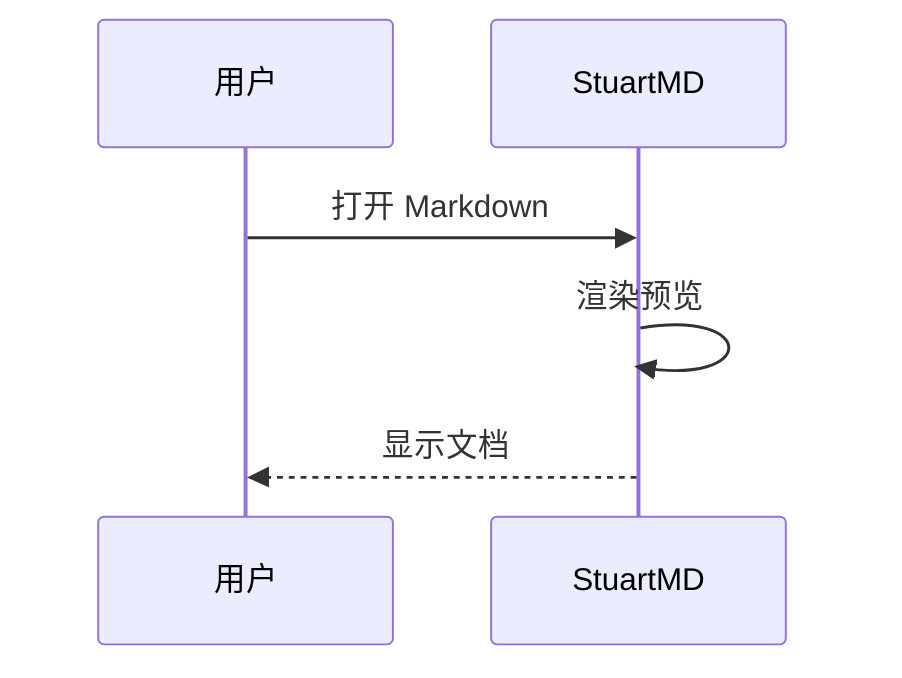

# 示例文档

欢迎使用 **StuartMD**——轻量 Markdown 阅读与编辑器。本文用于体验排版、公式、图表与编辑交互。

**当前版本：** 2.9.7

---

## 能做什么

| 场景 | 说明 |
|------|------|
| 读文档 | 美化排版、公式、表格、代码高亮 |
| 写笔记 | 阅读 / 分栏 / 源码，点击段落直接编辑 |
| 飞书式交互 | 块手柄、选中浮动栏、块菜单 |
| PDF | 打开即可阅读，支持标黄与擦除 |
| 多主题 | 浅色、灰色、深色、羊皮纸、小黄人、壁纸 |

## 快速开始

1. **文件** → 打开文件 / 打开文件夹
2. 顶部切换 **阅读 · 分栏 · 源码**
3. `Ctrl+S` 保存；有路径后会自动保存
4. 设置里可改主题、语言、插件、检查更新
5. 右上角切换**页宽**（默认 / 较宽 / 全宽）

## 文本样式

*斜体*、**加粗**、~~删除线~~、`行内代码`、<u>下划线</u>。

普通段落可以用来测试选中删除：下面有较长的连续正文，方便在阅读模式下拖选大段内容再删除，观察性能表现。

这是一段较长的中文正文示例。StuartMD 在阅读模式下会把 Markdown 渲染成接近纸质排版的样式，标题层级清晰，段落间距舒适，适合长时间阅读技术文档、会议纪要与读书笔记。你可以点击任意段落进入轻量编辑，也可以悬停左侧唤出块手柄，快速改标题、列表或代码块。选中文字后会出现浮动工具栏，支持加粗、斜体、链接与颜色等常用格式。

再补一段英文混排，便于检查字体与行高：StuartMD keeps Markdown reading calm and focused. Preview stays close to Typora-style rendering, while split mode puts **content on the left** and **source on the right**. Undo and redo stay available after every edit.

## 列表

- 项目 A
- 项目 B
  - 嵌套项 B1
  - 嵌套项 B2
- 项目 C

1. 第一步：打开文档
2. 第二步：阅读或编辑
3. 第三步：自动保存

## 任务列表

- [x] 安装并打开 StuartMD
- [x] 切换阅读 / 分栏 / 源码
- [ ] 试一下 PDF 标黄
- [ ] 换一个喜欢的主题（灰色推荐夜间）
- [ ] 在阅读模式选中一大段文字再删除

## 表格

| 名称 | 类型 | 说明 |
|------|------|------|
| 打开 | 按钮 | 选择文件或文件夹 |
| 主题 | 切换 | 浅色 / 灰色 / 深色 / 羊皮纸 / 小黄人 |
| 页宽 | 切换 | 默认 / 较宽 / 全宽 |
| 插件 | 开关 | `%APPDATA%\StuartMD\plugins\` |

## 代码块

```javascript
console.log("Hello StuartMD");

function greet(name) {
  return `你好，${name}！`;
}

// 大段选中删除性能测试时，也可以在源码模式操作
const features = ["render", "edit", "undo", "find", "pdf"];
features.forEach((f) => console.log(f));
```

```python
def greet(name: str) -> str:
    return f"你好，{name}！"

if __name__ == "__main__":
    print(greet("StuartMD"))
```

## LaTeX 公式

行内公式：$E = mc^2$，以及 $a^2 + b^2 = c^2$。

块级公式：

$$
\sum_{i=1}^{n} i = \frac{n(n+1)}{2}
$$

$$
\int_0^1 x^2\,dx = \frac{1}{3}
$$

## Mermaid 图表




## 引用

> 保持简单。
> 好的阅读器应该让内容成为主角，而不是界面。

> 多行引用也可以用来测试选中删除：
> 第二行内容。
> 第三行内容。

## 链接与脚注

访问 [CommonMark](https://commonmark.org/) 了解规范，或打开 [StuartMD Releases](https://github.com/ghostLLC/StuartMD/releases)。

## 分割线

---

## 编辑交互提示

- **悬停段落**：左侧出现块手柄（`T ⠿`）
- **点手柄**：块菜单（标题 / 列表 / 缩进 / 剪切 / 复制 / 删除）
- **选中文字**：浮动工具栏
- **双击复杂块**（表格 / 公式 / 代码 / Mermaid）：进入源码编辑
- **阅读模式大段选中 + Delete**：应快速完成，不卡顿
- **分栏**：左预览、右源码

## 常用快捷键

| 快捷键 | 作用 |
|--------|------|
| `Ctrl+O` | 打开文件 |
| `Ctrl+S` | 保存 |
| `Ctrl+F` | 查找 |
| `Ctrl+Z` | 撤销 |
| `Ctrl+Y` | 重做 |
| `Ctrl+1/2/3` | 阅读 / 分栏 / 源码 |

## PDF

- 打开 `.pdf` 即可阅读
- 标黄默认关闭；开启后选中文字标黄
- 关闭标黄时：单击高亮 → 右键「擦除此高亮」
- 工具栏：适应高度 / 旋转 / 双页 / Ctrl+滚轮缩放
- 清除全部高亮需二次确认

## 外观

设置 → 外观：浅色 / **灰色** / 深色 / 羊皮纸 / 小黄人 / 壁纸。

灰色主题基于深色，但黑底更灰、白字更柔，适合夜间阅读。

---

## 性能测试段落（可整段选中删除）

以下内容专供测试「阅读模式大段选中删除」：

1. 打开本示例文档，切到阅读模式。
2. 从「性能测试」标题开始，按住鼠标向下拖选到文末。
3. 按 `Delete` 或 `Backspace`，界面应较快更新，不应长时间无响应。
4. `Ctrl+Z` 可撤销刚才的删除。

测试段落甲：Markdown 渲染包含标题、列表、表格、代码与公式时，增量更新比整篇重排更重要。StuartMD 会尽量复用未变化的块，只重建被删改的部分。

测试段落乙：若你在删除后立刻撤销，历史栈应保持可用；再次重做（`Ctrl+Y`）也应恢复内容。

测试段落丙：侧边栏大纲会随标题变化刷新；文件夹搜索与 PDF 标黄不受本次删除影响。

测试段落丁：This paragraph exists so a large selection includes both Chinese and English text, which is common in technical notes.

测试段落戊：结束段。若删除整段后预览变空，属于正常现象；撤销即可回到完整示例。

---

有问题欢迎到仓库反馈：[GitHub Issues](https://github.com/ghostLLC/StuartMD/issues)。祝使用愉快。
