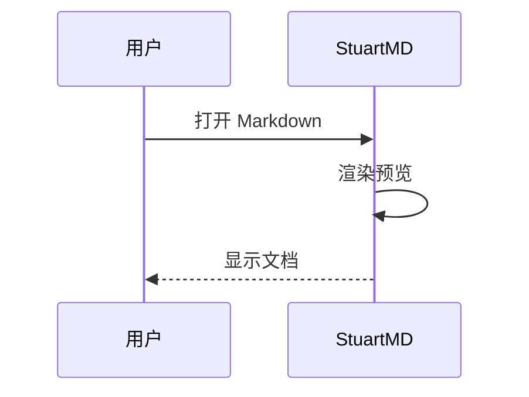

# 示例文档

欢迎使用 **StuartMD**。

## 文本样式

*斜体*、**加粗**、~~删除线~~、`code`。

## 列表

- 项目 A
- 项目 B
  - 嵌套项
1. 第一
2. 第二

## 任务

- [x] 已完成
- [ ] 待办

## 表格

| 名称 | 类型 | 说明 |
|------|------|------|
| 打开 | 按钮 | 选择文件 |
| 主题 | 切换 | 浅/深/羊皮纸/小黄人 |

## 代码

```python
def greet(name: str) -> str:
    return f"你好，{name}！"
```

## LaTeX 公式

行内 $a^2 + b^2 = c^2$

$$
\sum_{i=1}^{n} i = \frac{n(n+1)}{2}
$$

## Mermaid 图表



## 引用

> 保持简单。

---

## 链接

访问 [CommonMark](https://commonmark.org/)
